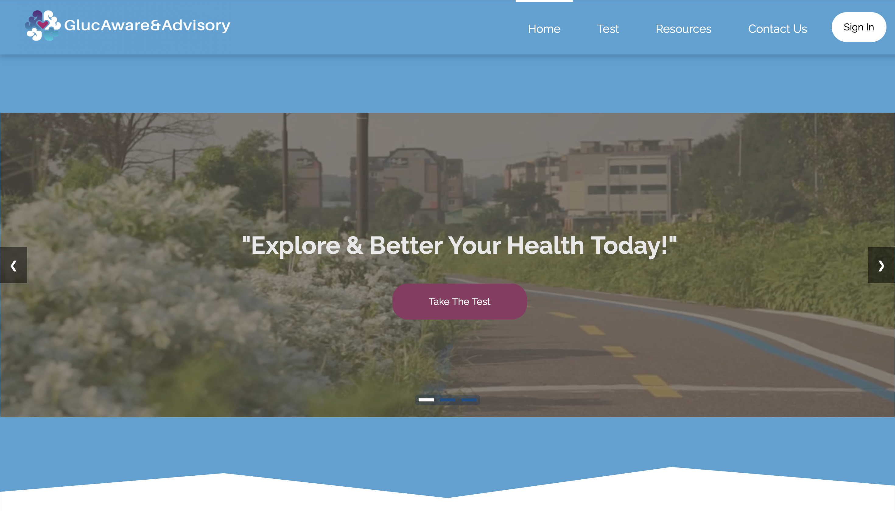
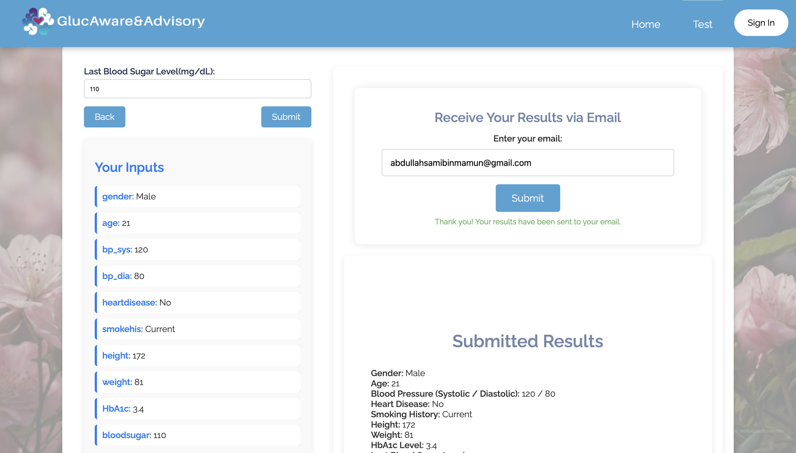

# GlucAware&Advisory App: Diabetes Advisory and Prediction Web App

GlucAware&Advisory App is a web application designed to predict diabetes risk and provide lifestyle recommendations using a user-friendly, accessible interface and a machine learning model. It supports five prediction outcomes unlike traditional models and takes your stress into account, health advisory charts, and multi-language health resources.



## System Architecture

The system is built using a modular design comprising:

- **Frontend** (HTML/CSS/JS with Jinja2 templates)
- **Backend** (Python Flask)
- **Machine Learning Model** (ML Libraries in Python)
- **Firestore Database** (User profiles and prediction history)
- **Firebase Authentication** (Login, Registration, Password Reset)

### Prediction Flow

1. Users access a questionnaire to input medical data.
2. Backend validates and sends data to the ML model.
3. ML model returns:
   - Diabetes status: Diabetic, Prediabetic, Non-diabetic, Stress-induced Diabetic, or Stress-induced Prediabetic
   - Hypertension status
   - BMI status
4. Results are shown on the frontend and optionally saved if user is logged in.

---

## Home Page

- Provides an overview of the app's purpose and features
- Navigation bar + footer links for easy routing
- Contains general diabetes advice, embedded relaxation music
- Available for both guests and registered users

---

## Questionnaire & Results

- Open to all users (guests & registered)
- Inputs collected:
  - Gender
  - Age
  - Weight & Height
  - Smoking history
  - Blood pressure
  - Heart disease status
  - Blood sugar level
  - HbA1c
- Outputs shown:
  - Diabetes outcome
  - Hypertension status
  - BMI classification




### Features
- Inputs editable post-submission
- Predictions flagged with red indicators if critical
- Flash messages for status updates

---

## User Authentication (Firebase)

- Sign-up, login, and password reset with Firebase Authentication
- Secure sessions for viewing and storing predictions
- Input validations and friendly flash messaging

---

## User Profile & History

- Stores:
  - Username, email, DOB, gender, medical conditions
  - Full prediction history with timestamps
- Features:
  - Track health trends
  - Quick navigation to diet/lifestyle chart generator

---

## Chart Generator

- Provides personalized schedules for:
  - Hypertension prevention
  - Stress management
  - BMI control
  - Diabetes management
  - General wellness
- Available schedules:
  - Day shift
  - Night shift
  - Flexible routine
- Chart delivery via email supported

---

## Resources Page

- Educational articles, videos, blogs, and courses
- Available in:
  - English
  - French
  - Malay
  - Hindi
  - Mandarin

---

## User Interface Design

- Clean, minimalist layout
- Theme colors: Blue, Dark Magenta, White (diabetes awareness)
- Fixed top navbar and clear navigation states
- Carousel slides on homepage
- Responsive buttons with hover effects
- Consistent theme across all pages
- Accessible layout adaptable to various screen sizes
- Chunked content to reduce cognitive overload
- Flash messaging and strong error handling

---

## Contact

Users can reach the developer through the `/contact_us` form with stored messages in Firestore.

---

## Deployment

- Hosted on **Heroku**
- Firebase credentials stored securely via `heroku config:set FIREBASE_CREDENTIALS`
- ML model and auth handled entirely in Python/Flask

---

## Live Preview

> [App Link](https://glucaware-e4e2c8fc9a82.herokuapp.com)

---

## RUN THIS SOFTWARE?

readme_path = "/mnt/data/README.md"

## 💻 How to Run the Code

### STEP 1. Clone the Repository
```bash
git clone https://github.com/yourusername/diabetes-advisory-app.git
cd diabetes-advisory-app

### STEP 2. Setup the Virtual Environment
python -m venv venv
On Mac: source venv/bin/activate
On Windows: venv\\Scripts\\activate

### STEP 3. Install relevant dependencies
pip install -r requirements.txt

### STEP 4. Setup the env & firebase
Create a .env file in the root directory with the following variables:

FIREBASE_API_KEY=your_firebase_api_key #get it from firebase app
FIREBASE_CREDENTIALS_JSON=contents_of_your_service_account_json_file

### STEP 5. Run the application locally
Once you set up the venv and install dependencies in the venv
proceed to the backend folder by cd src backend
then RUN>>
python run.py
Then visit: http://127.0.0.1:5000


