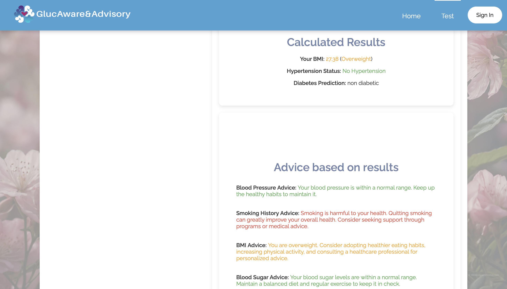

# GlucAware&Advisory App: Diabetes Advisory and Prediction Web App

GlucAware&Advisory App is a web application designed to predict diabetes risk and provide lifestyle recommendations using a user-friendly, accessible interface and a machine learning model with extremely high accuracy (98.25%). It supports **five prediction outcomes** unlike traditional models and includes stress-sensitive diagnostics, health advisory charts, and multilingual health resources.

---

 
 
## System Architecture

The system is built using a modular architecture:

- **Frontend:** HTML/CSS/JavaScript (Jinja2 templating via Flask)
- **Backend:** Python Flask
- **ML Model:** Trained in Python
- **Firestore:** Stores user profiles & prediction histories
- **Firebase Auth:** Manages login, registration, and password reset

---

## Prediction Flow

1. Users complete a health questionnaire.
2. Backend sends data to ML model for prediction.
3. ML Model returns:
   - Diabetes status (5 possible outcomes)
   - Hypertension status
   - BMI classification
4. Results are shown on screen. If logged in, they’re stored.

---

## Home Page

- Provides app overview and features
- Includes:
  - Navigation bar
  - Footer links
  - Diabetes awareness + relaxing music
- Same for guests & registered users

---

## Questionnaire & Prediction Results

- Inputs:
  - Gender, Age, Weight, Height
  - Smoking History
  - Blood Pressure
  - Heart Disease Status
  - Blood Sugar Level
  - HbA1c (%)
- Outputs:
  - Diabetes (5 outcomes)
  - BMI category
  - Hypertension status



 
 
Features:
- Inputs are editable even post-submission
- Critical indicators (like high BP) flagged red
- Flash messaging included

---

## User Authentication

- **Firebase Authentication**
- Handles sign-up, login, and password resets
- Sessions + Flash messages for feedback
- Secure form validations

---

## User Profile & History

- Displays:
  - Username, DOB, Email, Gender, Medical Conditions
  - Prediction history with timestamps
- Features:
  - Acts as health tracker
  - Direct access to personalized chart generator

---

## Chart Generator

- Generates customized advisory charts for:
  - Hypertension prevention
  - Stress management
  - Weight/BMI control
  - Diabetes care
  - General health & wellness

- Timetable options:
  - Morning/Day-shift
  - Night-shift
  - Flexible routines

- Chart delivery via email supported
- Accessible by both guests and logged-in users

---

## Resources Page

- Offers curated:
  - Articles, blogs, videos, free courses
- Languages supported:
  - English, French, Malay, Hindi, Mandarin
- Aimed at:
  - Diabetes prevention
  - Stress, BMI, hypertension management

---

## User Interface Highlights

- Clean, minimal, accessible design
- Theme Colors: Blue (awareness), Dark Magenta, White
- Fixed top navbar + page indicators
- Carousel on homepage
- Responsive buttons (hover animations)
- Consistent font/colors/sections
- Chunked layout to reduce overload
- Flash messaging & form error handling
- Input review/editing post-submission

---

## Contact Developer

- `/contact_us` form available for feedback
---

## Deployment

- Deployed via **Heroku**
- Firebase credentials set via:
```bash
heroku config:set FIREBASE_CREDENTIALS="$(cat config/firebase-adminsdk.json | jq -c .)"
heroku config:set FIREBASE_API_KEY=your_firebase_api_key
```

---

## Live Preview

🔗 [View App](https://glucaware-e4e2c8fc9a82.herokuapp.com)

---

## How to Run the Code

### STEP 1: Clone the repository
```bash
git clone https://github.com/yourusername/diabetes-advisory-app.git
cd diabetes-advisory-app
```

### STEP 2: Setup the virtual environment
```bash
python -m venv venv
# On Mac/Linux:
source venv/bin/activate
# On Windows:
venv\Scripts\activate
```

### STEP 3: Install dependencies
```bash
pip install -r requirements.txt
```

### STEP 4: Configure environment variables

Create a `.env` file in the root directory and add:
```
FIREBASE_API_KEY=your_firebase_api_key
FIREBASE_CREDENTIALS_JSON=<paste one-line JSON of service account>
```

**Note:** You can generate the `FIREBASE_CREDENTIALS_JSON` using:
```bash
cat config/firebase-adminsdk.json | jq -c .
```

### STEP 5: Run the app
```bash
cd backend
python run.py
```

Now open: [http://127.0.0.1:5000](http://127.0.0.1:5000)

this will eventually lead to the flask server running the web application.
